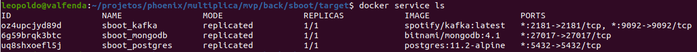

# Template de microserviço com springboot
Este template é totalmente funcional. Ele utiliza tecnologia springboot com java jdk 8 ou superior, compilado com maven 3+. 

Para ajudar na configuração completa do ambiente local de desenvolvimento, este template utiliza docker em modo swarm, com os serviços abaixo:
- banco de dados PostgresSQL 11
- mensageria Kafka
- MongoDB 4.1

Portanto, para execução de todos os recursos do template é necessário conferir os seguintes pré-requisitos:
- docker com swarm
- jdk 1.8 ou superior

## Compilação do microserviço
Junto com a compilação do código fonte java, o template também prepara alguns arquivos que serão utilizados para montar a stack no docker. 
Para compilar o template, utilize o comando maven tradicional:

```
mvn clean package
```

Ao finalizar a compilação, verifique que no diretório "target" estarão, além do compilado java, alguns arquivos auxiliares:

- Dockerfile: arquivo de instruções para montar a imagem docker da aplicação java;
- docker-compose.yml: compose para montar a stack completa no docker service, incluindo a própria aplicação java;
- docker-stack.yml: compose para montar a stack completa no docker service, sem a aplicação java;
- README-stack.md: instruções para subir a stack no docker;
- curl-requests.txt: exemplos de requests no curl para a aplicação java;
- postman-collection.json: coleção de requests no postman para a aplicação java;
- stack.sh: shell script para automatizar tarefa de subida da stack;
- standalone.sh: shell script para automatizar tarefa de subida de containers simples das ferramentas auxiliares.

## Stack de desenvolvimento
Tal como mencionado no início deste README, este template utiliza postgres, kafka e mongodb integrados ao java springboot.

Para subir a stack de desenvolvimento completa em sua estação de trabalho, execute o comando stack.sh, localizado no diretório target do projeto (após compilar com maven):

```
$ cd target
$ chmod +x stack.sh
$ ./stack.sh
```
Após subir a stack, será possível observar os serviços docker rodando:


## Utilizando o kafka

### Acessar o bash do container do kafka
Antes de mais nada é necessário localizar o container do kafka dentre os containers em execução. Para a stack usada como exemplo nesta wiki, o container kafka iniciará pelo nome **sboot_kafka**... O nome do container pode ser localizado com o comando abaixo:
```
$ docker container ls
```

Em seguida, entrar no shell do container kafka com o comando:
```
$ docker exec -it [nome-container-kafka] bash
```

### Listar os tópicos existentes
```
$ $KAFKA_HOME/bin/kafka-topics.sh --list --zookeeper localhost:2181
```
### Criar um tópico novo
A aplicação springboot cria automaticamente os tópicos no kafka em sua inicialização. Como exercício, o comando dentro do container para criação de tópicos é o seguinte:

```
$ $KAFKA_HOME/bin/kafka-topics.sh --create --zookeeper localhost:2181 --replication-factor 1 --partitions 1 --topic [nome-do-topico]
```

### Criar mensagens para o tópico
Com o comando abaixo é aberto um input que vai aguardar por mensagens digitadas para enviar ao tópico:
```
$KAFKA_HOME/bin/kafka-console-producer.sh --broker-list localhost:9092 --topic [nome-do-topico]
```

Em seguida, digite o conteúdo de uma mensagem e depois pressione enter.
```
{"id": "ononono", "name": "Fulano", "surname": "de Tal"}

```
Para sair do modo input, pressione Ctrl+C.

### Ler as mensagens do tópico
O comando abaixo abre um listener que vai ficar "escutando" as mensagens enviadas para um determinado tópico:
```
$KAFKA_HOME/bin/kafka-console-consumer.sh --bootstrap-server localhost:9092 --from-beginning --topic [nome-do-topico]
```

### Sair do shell do container
Uma vez utilizado o shell do container, digite "exit" e pressione enter para sair.

